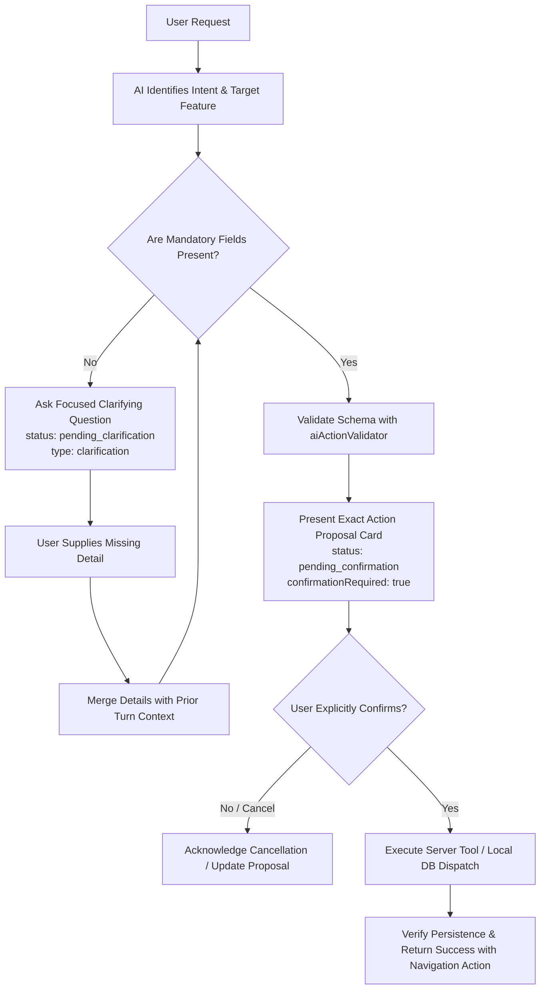

# FOCENTIA APPLICATION CAPABILITY REGISTRY

---

## 1. OVERVIEW & SCOPE
This document is the authoritative, typed registry of all genuine application features, database models, navigation destinations, server-side tools, and confirmation requirements supported by Focentia AI (Phase 2).

All AI tools, action generators, and server processors MUST conform strictly to this registry. No unsupported fields, artificial stages, fake milestones, or unverified navigation destinations may be introduced.

---

## 2. NAVIGATION ROUTING SITEMAP

| Route ID | Page / Feature Name | URL Path / View | Description | Mutation Confirmation Needed? |
| :--- | :--- | :--- | :--- | :--- |
| `today` | Today's Dashboard | `/today` (or home) | Productivity score, streak, Big 3 tasks, habits | **No** (Read/Navigate only) |
| `planner` | Planner & Schedule | `/planner` | Time-slots, daily routine, now/next/later tiers | **No** (for navigation) |
| `focus` | Focus Mode & Timer | `/focus` | Stopwatch count-up timer, focus goals, breaks | **No** (for navigation) |
| `tasks` | Notes & Files | `/tasks` (or `/notes`) | Block editor workspace, KaTeX, attachments | **No** (for navigation) |
| `mind` | Mind Space | `/mind` | Brain dump, idea vault, problem solver | **No** (for navigation) |
| `diary` | My Diary | `/diary` | Topic-based journaling, mood tracking | **No** (for navigation) |
| `learning` | Time Log & Learning Hub | `/learning` | Skill practice logs, blockers, important topics | **No** (for navigation) |
| `notifications` | Notification Center | `/notifications` | Push notification settings, scheduled alerts | **No** (for navigation) |
| `profile` | User Profile | `/profile` | User stats, level, productivity metrics | **No** (for navigation) |
| `settings` | Application Settings | `/settings` | Theme presets, E2EE key recovery, preferences | **No** (for navigation) |

---

## 3. FEATURE SCHEMAS & TOOL CONTRACTS

### 3.1 Planner & Task Management
- **Target Route:** `planner`
- **Backend Service:** `dbGetTasks`, `dbUpsertTask`, `dbDeleteTask`
- **Ownership:** Scoped to authenticated `user_id`.
- **Mandatory Fields for Single Task:**
  - `title` (string, non-empty)
  - `targetDate` (string, format `YYYY-MM-DD`)
  - `time` (string, 24-hour format `HH:MM`)
- **Optional Fields:**
  - `estimatedMinutes` (number, default: 30, min: 5, max: 480)
  - `priority` (`'low'` | `'medium'` | `'high'` | `'urgent'`, default: `'medium'`)
  - `category` (string, default: `'Study'`)
  - `notes` (string)
  - `tier` (`'now'` | `'next'` | `'later'`, default: `'now'`)
- **Batch Tasks (`create_tasks`):**
  - `tasks`: Array of objects, each containing mandatory `title` and `targetDate`.
- **Confirmation Policy:** `confirmationRequired: true` (mandatory for all creation/update/deletion).

### 3.2 Focus Session & Deep Work
- **Target Route:** `focus`
- **Backend Service:** `dbCreateFocusSession`, `dbGetFocusSessions`
- **Ownership:** Scoped to authenticated `user_id`.
- **Mandatory Fields:**
  - `durationMinutes` (number, min: 1, max: 300)
- **Optional Fields:**
  - `goal` / `taskName` (string, default: `'Deep Work Session'`)
  - `mode` (`'deep'` | `'pomodoro'`, default: `'deep'`)
  - `category` (string, default: `'Study'`)
- **Confirmation Policy:** `confirmationRequired: true`.

### 3.3 Notes & Files (Block Editor)
- **Target Route:** `tasks`
- **Backend Service:** `dbGetNotes`, `dbUpsertNote`, `dbDeleteNote`
- **Ownership:** Scoped to authenticated `user_id`.
- **Mandatory Fields:**
  - `title` (string, non-empty)
- **Optional Fields:**
  - `content` (string, markdown/text to initialize first paragraph block)
  - `category` (string, default: `'AI Generated'`)
  - `blocks` (array of `NoteBlock`)
- **Confirmation Policy:** `confirmationRequired: true`.

### 3.4 My Diary & Journaling
- **Target Route:** `diary`
- **Backend Service:** `dbGetDiaryTopics`, `dbSaveDiaryTopic`
- **Ownership:** Scoped to authenticated `user_id`.
- **Mandatory Fields:**
  - `content` (string, non-empty)
- **Optional Fields:**
  - `title` (string, default: `"Today's Diary Entry"`)
  - `topicTitle` (string, default: `'General'`)
  - `mood` (`'reflective'` | `'happy'` | `'calm'` | `'motivated'` | `'neutral'` | `'sad'` | `'stressed'`, default: `'reflective'`)
- **Confirmation Policy:** `confirmationRequired: true`.

### 3.5 Time Log & Learning Hub
- **Target Route:** `learning`
- **Backend Service:** `dbGetLearningData`, `dbSaveLearningFolder`, `dbSaveLearningLog`
- **Ownership:** Scoped to authenticated `user_id`.
- **Strict Schema Rule:** ONLY genuine Time Log fields are supported. NEVER fabricate study-hour estimates, milestones, stages, or unsupported concepts.
- **Mandatory Fields for Activity Log (`log_activity`):**
  - `folderName` or `topics` (string, non-empty)
  - `practiceMinutes` (number, positive integer)
- **Optional Fields:**
  - `watchMinutes` (number, default: 0)
  - `practiceDetails` (string)
  - `blockers` (string)
  - `importantTopics` (string)
- **Mandatory Fields for Topic/Folder (`create_skill_roadmap` / `create_skill`):**
  - `folderName` (string, non-empty)
- **Optional Fields:**
  - `targetHours` (number, default: 20)
  - `roadmapSteps` (string[])
- **Confirmation Policy:** `confirmationRequired: true`.

### 3.6 Mind Space (Brain Dump, Problem Solver & Idea Vault)
- **Target Route:** `mind`
- **Backend Service:** `dbGetMindItems`, `dbUpsertMindItem`, `dbDeleteMindItem`
- **Ownership:** Scoped to authenticated `user_id`.
- **Problem Solver (`create_problem_solver`):**
  - Mandatory: `problem` (string, non-empty)
  - Optional: `solutionSteps` (string[]), `tags` (string[])
- **Idea Capture (`create_idea`):**
  - Mandatory: `idea` (string, non-empty)
  - Optional: `keyPoints` (string[]), `nextAction` (string), `category` (string)
- **Confirmation Policy:** `confirmationRequired: true`.

---

## 4. SERVER-SIDE APPLICATION TOOLS (READ & QUERY)

| Tool Name | Scope / Auth | Input Arguments | Output Description |
| :--- | :--- | :--- | :--- |
| `search_planner_entries` | `user_id` verified | `{ query?: string, startDate?: string, endDate?: string, status?: string }` | Filtered array of user tasks and timeblocks with sanitized metadata. |
| `get_planner_entries_for_date` | `user_id` verified | `{ date: string }` | All scheduled tasks & time slots for target date `YYYY-MM-DD`. |
| `propose_planner_entries` | `user_id` verified | `{ entries: TaskProposal[] }` | Validates tasks and returns pending proposal with server action IDs. |
| `get_time_log_topics` | `user_id` verified | `{ folderName?: string }` | User learning folders, logs, practice minutes, blockers, important topics. |
| `search_notes_and_files` | `user_id` verified | `{ query: string, category?: string }` | Matching notes with title, preview snippet, block count, and timestamps. |
| `get_note_or_file_content` | `user_id` verified | `{ noteId?: number, title?: string }` | Full text content of specific note owned by user. |
| `search_diary_entries` | `user_id` verified | `{ query?: string, topicTitle?: string }` | Diary topics and entries matching query or topic. |
| `get_diary_entry` | `user_id` verified | `{ topicId?: string, entryId?: string, topicTitle?: string }` | Specific diary entry content and metadata. |
| `get_performance_report` | `user_id` verified | `{ timeframe?: 'daily' \| 'weekly' \| 'monthly' }` | Focus minutes, tasks completed, streak, and practice time analytics. |
| `get_available_app_destinations` | Public/Static | `{}` | Complete sitemap of verified application navigation routes. |
| `prepare_navigation` | Safe Client | `{ route: string }` | Validates target destination and produces navigation action (`confirmationRequired: false`). |

---

## 5. CLARIFICATION & CONFIRMATION PROTOCOL

### Protocol Rules:
1. **Never mutate data without explicit confirmation.**
2. **Never guess missing mandatory parameters (e.g. date/time for planner tasks).**
3. **Preserve multi-turn history so user answers are not lost across turns.**
4. **Modified proposals invalidate previous confirmations and require renewed confirmation.**
5. **Read tools and Navigation actions do not require mutation confirmations.**

---

## 6. DATA SECURITY & TENANT ISOLATION RULES
1. **Derived User Identity:** The AI server must NEVER trust a `user_id` passed inside LLM context. The user ID is strictly extracted from the authenticated JWT session or verified request header.
2. **Zero SQL Exposure:** No tool may accept raw SQL, execute arbitrary database queries, or query tables outside its explicit domain function.
3. **Sanitized AI Context:** Secrets, passwords, bearer tokens, API keys, and sensitive credentials are automatically redacted before sending any payload or database records to Gemini.
4. **No Cross-User Access:** All database queries enforce `WHERE user_id = $1`. An attempt to read or mutate another user's record returns empty / unauthorized.
